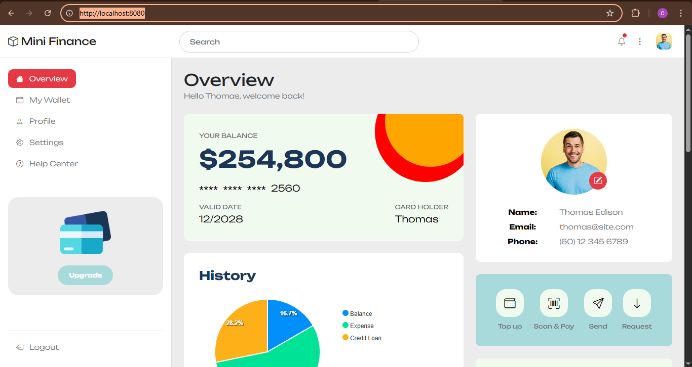

# Static Website Project with AWS, Terraform, Docker & GitHub Actions.

### This project provisions and deploys a static website using AWS cloud services, Infrastructure as Code with Terraform, and CI/CD pipelines with GitHub Actions and Docker for local testing. The static site template was sourced from Tooplate.

## Tools & Services Used
## 1. Terraform

Used as Infrastructure as Code (IaC) to define and manage cloud resources.

Modularized for each AWS service (S3, CloudFront, Route 53).

Ensures reproducibility and easy provisioning/teardown.

 ## How to Use Terraform
+ ### Initialize Terraform:
`terraform init`
+ ### Validate configuration:
`terraform validate`
+ ### Plan the deployment:
`terraform plan`
+ ### Apply the configuration:
`terraform apply`
+ ### Destroy the infrastructure:
`terraform destroy`

## 2. AWS Services

+ ### Amazon S3

Stores the static website files.

Configured as the origin for CloudFront.

+ ### Amazon CloudFront

Global Content Delivery Network (CDN).

Improves performance and caching of static content.

Integrated with ACM (SSL/TLS certificate) for HTTPS.

+ ### Amazon Route 53

Provides DNS for the custom domain.

Routes traffic to the CloudFront distribution.

+ ### AWS Certificate Manager (ACM)

Issues and manages the SSL/TLS certificate for secure HTTPS access.

## 3. Docker

A lightweight `nginx:alpine` image is used to serve the static website locally.

Useful for local testing before deployment to AWS.

## 4. GitHub Actions (CI/CD)

**Deploy Pipeline:** Uploads website files to S3 automatically on push.

**Apply Pipeline:** Runs `terraform apply` to provision AWS resources.

**Destroy Pipeline:** Runs `terraform destroy` to tear down AWS resources when needed.

## How to Run Locally with Docker

### Build the Docker image:

`docker build -t image-name .`

### Run the container:

`docker run -d -p 8080:80 static-site`

### Open your browser at:
 http://localhost:8080
 

### Stop the container:
`docker stop <container_id>`
### Remove the container:
`docker rm <container_id>`

## Deployment Flow

Website files are uploaded to S3.

CloudFront serves them globally with caching.

Route 53 handles DNS and routes traffic to CloudFront.

ACM ensures secure HTTPS connections.

GitHub Actions pipelines automate deployment, apply, and destroy steps.

## Notes

Ensure AWS credentials are configured for Terraform and GitHub Actions.  
Modify the Terraform variables as needed for your AWS setup and domain.  
The static website template can be customized by replacing files in the `2135_mini_finance` directory.  
The Dockerfile can be adjusted to use a different base image or serve method if needed.
The GitHub Actions workflows can be customized for additional steps or notifications as required.  

## Acknowledgements
Static website template from [Tooplate](https://www.tooplate.com/).  

### The goal of this project is to serve as a hands-on example of combining IaC, CI/CD, and AWS services for a scalable static website deployment. I hope it helps others learn and build similar projects.
